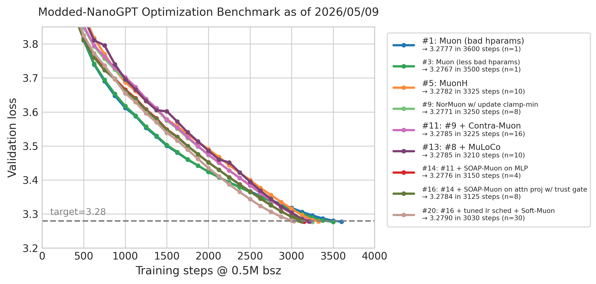
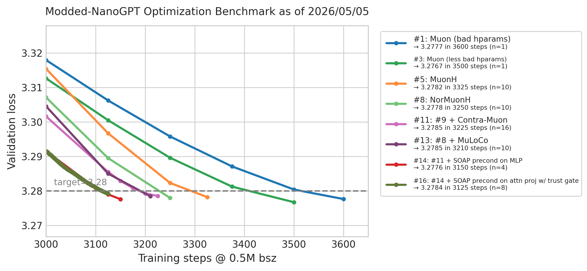
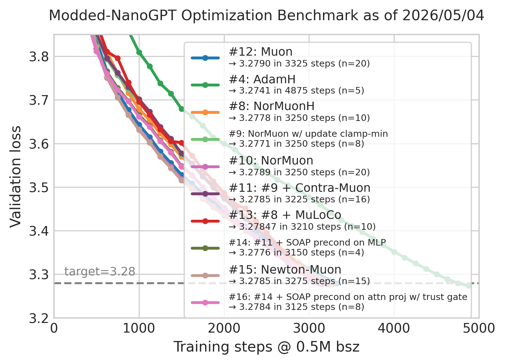
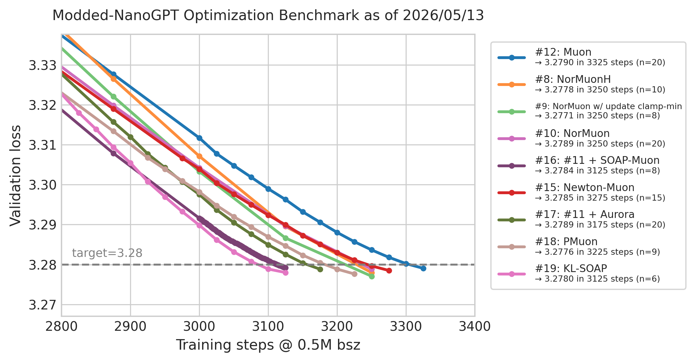

# Modded-NanoGPT Optimization Benchmark

The goal of this benchmark is to collaboratively|competitively find efficient neural network optimizers.
Unlike the main NanoGPT speedrun which seeks to minimize *wallclock time* by any means, here we aim to minimize *step count* by improving the optimization algorithm (⇒ methods that are slow in terms of wallclock are perfectly OK).

[Longform announcement](https://x.com/kellerjordan0/status/2049193527440187494)

Thank you to everyone who's contributed results so far:
@kaiyue-wen, @nilin, @alint77, @wilsoncwu, @kumarkrishna, @lliu606, @bentherien, @Sam_Acqua, @zhehangdu, @SPThole, @liyang2019, and @zzp1012.


## Quickstart

The baseline setup (Muon with aux Adam) can be run using the following command on any {1,2,4,8}x-{A,H}100 machine:
```bash
git clone https://github.com/KellerJordan/modded-nanogpt.git && cd modded-nanogpt
pip install torch==2.11 huggingface_hub
python data/cached_fineweb10B.py 40  # downloads 4B training tokens
torchrun --standalone --nproc_per_node=$(nvidia-smi -L | wc -l) records/track_3_optimization/train_gpt_simple.py
```

Note: [Beware that](https://github.com/KellerJordan/modded-nanogpt/issues/268) on A100, using `torch==2.10` with `torch.compile` enabled will lead to `nan`s.

## Notable results history

The following results each improved the best known hyperparameters for an optimizer on this benchmark.
Many more non-SOTA results (e.g., from hyperparameter sweeps) can be found in `results/`.

Notes:
* To reproduce any of these runs, simply rip their python script out of their logfile (take everything before `===`), and then run it using the quickstart above.
If it fails to reproduce (i.e., we get statistical evidence that its mean is above 3.28), then please report that, as it will be grounds to remove the run from the history.
* The number in the leftmost column reflects the order in which these runs were accepted. This does not necessarily line up with the Date column, which is the date at which the PR appeared.
* The (!) symbol next to the step count indicates a result that sets a new global step-count record (across all optimizers).

| # | Steps to 3.28 | Evidence | Description | Date | Log | PR | Contributors |
| - | -             | -        | -           | -    | -   | -  | -            |
| 1 | 3600(!) | 3.2777 (n=1)Ⓧ | [Muon](https://kellerjordan.github.io/posts/muon/) with aux Adam, lr=.02 wd=.01 | 2026/04/26 | [log](results/7b8270c5-a9cd-4a73-b7d8-5d86a2d1e428.txt) | N/A | @kellerjordan0 |
| 2 | 5625 | 3.2790 (n=1)Ⓧ | [AdamW](https://arxiv.org/abs/1711.05101) lr=0.0015 wd=0.1 betas=(0.9, 0.95) warmup_steps=250 (note: this is most likely undertuned) | 2026/04/26 | [log](results/a63a68d1-24aa-4a22-af9a-224e43209ea4.txt) | N/A | @kellerjordan0 |
| 3 | 3500(!) | 3.2767 (n=1)Ⓧ | Muon with aux Adam, lr=.025 wd=.0125 | 2026/04/26 | [log](results/311d7833-8dfc-43ea-a55c-fd313a11c4a8.txt) | N/A | @kellerjordan0 |
| 4 | 4875 | 3.2741 (n=5)✓ | [AdamH](https://psychedelic-sunstone-851.notion.site/Fantastic-Pretraining-Optimizers-and-Where-to-Find-Them-2-1-Hyperball-Optimization-2e924306e6f280e7a5ffee00eb40a0dd) (Adam preconditioning + hyperball constraint on hidden matrices) with per-module init std (attn.proj std=.026, mlp.proj std=.031, mlp.fc std=.031, qkv default), lr=.018 betas=(0.9, 0.95) warmup_steps=250 h_cooldown_frac=1.0 aux_cooldown_frac=.4 | 2026/04/30 | [log](results/20260430_adamh/7533dd87-107f-4a4f-8229-acbec0fb00ac.txt) | [PR](https://github.com/KellerJordan/modded-nanogpt/pull/272) | @kaiyue-wen (note: hyperball author) |
| 5 | 3325(!) | 3.2782 (n=10)✓ | [MuonH](https://psychedelic-sunstone-851.notion.site/Fantastic-Pretraining-Optimizers-and-Where-to-Find-Them-2-1-Hyperball-Optimization-2e924306e6f280e7a5ffee00eb40a0dd) (Muon + hyperball constraint on hidden matrices) with per-module init std (attn.proj std=.026, mlp.proj std=.031, mlp.fc std=.031, qkv default), lr=.018 h_cooldown_frac=1.0 aux_cooldown_frac=.4 | 2026/04/30 | [log](results/20260430_muonh/9319c798-6643-464a-b407-b05468e468f5.txt) | [PR](https://github.com/KellerJordan/modded-nanogpt/pull/267) | @kaiyue-wen |
| 6 | 3375 | 3.2788 (n=20)✓ | Muon with aux Adam, lr=.025 wd=.025 | 2026/05/01 | [log](results/51ece938-03c5-4343-8dcc-3f3336b07008.txt) | [PR](https://github.com/KellerJordan/modded-nanogpt/pull/271) | @nilin, @alint77 |
| 7 | 3325 | 3.2752 (n=1)✓ | [Muon²](https://arxiv.org/abs/2604.09967) with aux Adam, lr=.10 wd=.0125 β₂=.95 ε=1e-10 | 2026/04/29 | [log](results/20260501_muonsq/bb903816-ea27-4f5f-8028-c963d38c6a7f.txt) | [PR](https://github.com/KellerJordan/modded-nanogpt/pull/266) | @wilsoncwu |
| 8 | 3250(!) | 3.2778 (n=10)✓ | [NorMuon](https://arxiv.org/abs/2510.05491)[H](https://psychedelic-sunstone-851.notion.site/Fantastic-Pretraining-Optimizers-and-Where-to-Find-Them-2-1-Hyperball-Optimization-2e924306e6f280e7a5ffee00eb40a0dd) (Muon NS direction + Adafactor-style row/col variance preconditioning, then hyperball constraint on hidden matrices) with per-module init std (attn.proj std=.026, mlp.proj std=.031, mlp.fc std=.031, qkv default), lr=.018 mu=0.95 beta2=0.95 h_cooldown_frac=1.0 aux_cooldown_frac=.4, end 25 steps early | 2026/04/30 | [log](results/20260430_normuonh/f45b5dcf-16bb-4e83-b5c7-4ef4981f0e9f.txt)| [PR](https://github.com/KellerJordan/modded-nanogpt/pull/273) | @kaiyue-wen |
| 9 | 3250 | 3.2771 (n=8)✓ | NorMuon with aux Adam + u/w-floor (wd-free strategy that clamps ‖u‖\_F / ‖w‖\_F to 0.35), lr=.0375 | 2026/04/29 | [log](results/20260501_skylight001/f78af80a-2ba3-4cf7-b9f7-e6e56ff2c54d.txt) | [PR](https://github.com/KellerJordan/modded-nanogpt/pull/274) | @kumarkrishna |
| 10 | 3250 | 3.2789 (n=20)✓ | NorMuon lr=0.035 wd=0.025, end 50 steps early | 2026/05/03 | [log](results/20260503_normuon/e0d0185f-ccb8-426d-8265-a4e762ec69f6.txt) | [PR](https://github.com/KellerJordan/modded-nanogpt/pull/276) | @lliu606 (note: NorMuon author) |
| 11 | 3225(!) | 3.2785 (n=16)✓ | Setup from #9 plus [Contra-Muon](https://github.com/nilin/contra-muon) technique (note: not [statsig](#pairwise-statistical-significance) vs #9) | 2026/05/01 | [log](results/20260501_contra_muon/08cd60f9-99e2-4e28-b1ac-19136dd42a05.txt) | [PR](https://github.com/KellerJordan/modded-nanogpt/pull/275) | @nilin |
| 12 | 3325 | 3.2790 (n=20)✓ | Muon with aux Adam, lr=.035 wd=.025 following #10, end 25 steps early following #8 | 2026/05/03 | [log](results/1bd8db7a-f3a3-4195-856d-cab7e0816443.txt) | N/A | @kellerjordan0 |
| 13 | 3210(!) | 3.2785 (n=10)✓ | NorMuonH (#8) wrapped in [MuLoCo](https://arxiv.org/abs/2502.07314)-style outer Nesterov SGD (Algorithm 1, K=1) over all trainable params, outer_lr=0.7 outer_momentum=0.5 sync_interval=30 (= 107 outer steps) (note: not [statsig](#pairwise-statistical-significance) vs #8 or #11) | 2026/05/04 | [log](results/20260504_muloco_normuonh/7fba9434-58d8-4166-b6a7-d62ef8d17e5d.txt) | [PR](https://github.com/KellerJordan/modded-nanogpt/pull/277) | @bentherien |
| 14 | 3150(!) | 3.2776 (n=4)✓ | Setup from #11, plus SOAP preconditioning before Muon orthogonalization for the MLP weights. Related to [soap-muon](https://nikhilvyas.github.io/SOAP_Muon.pdf) | 2026/05/04 | [log](results/20260504_contra_muon_mlp_soapish/0248394b-0d6c-4133-9ff7-e7ff2763cdd9.txt) | [PR](https://github.com/KellerJordan/modded-nanogpt/pull/278) | @Sam_Acqua |
| 15 | 3275 | 3.2785 (n=15)✓ | [Newton-Muon](https://arxiv.org/abs/2604.01472) with activation-covariance right-preconditioning refreshed every 64 steps before the Muon Newton-Schulz update ([details](results/20260505_newton_muon/README.md)); tuned lr/wd per param type | 2026/05/05 | [log](results/20260505_newton_muon/6fb302c7-d271-491b-906f-75cd6ec72075.txt) | [PR](https://github.com/KellerJordan/modded-nanogpt/pull/281) | @zhehangdu (note: Newton-Muon author) |
| 16 | 3125(!) | 3.2784 (n=8)✓ | Setup from #14, plus SOAP precond for attention with trust gate (note: not [statsig](#pairwise-statistical-significance) vs #14) | 2026/05/05 | [log](results/20260506_trustlight/fake_log_from_seed0.txt) | [PR](https://github.com/KellerJordan/modded-nanogpt/pull/283) | @SPThole |
| 17 | 3175 | 3.2789 (n=20)✓ | Setup from #11, plus [Aurora](https://github.com/tilde-research/aurora-release) | 2026/05/06 | [log](results/20260505_aurora/298f02bc-dbb4-4661-9ad8-f6429d532873.txt) | [PR](https://github.com/KellerJordan/modded-nanogpt/pull/284) | @liyang2019 (note: Aurora author) |
| 18 | 3225 | 3.2776 (n=9)✓ | [PMuon](results/20260507_pmuon/README.md) (Muon + bilateral streaming covariance power preconditioning), lr=.035 wd=.025 γ=.3 β=.95 | 2026/05/07 | [log](results/20260507_pmuon/54fc0541-7a62-4772-a8f8-d3a46ad10dba.txt) | [PR](https://github.com/KellerJordan/modded-nanogpt/pull/285) | @zzp1012 |
| 19 | 3125 | 3.2780 (n=6)✓ | Setup from #8, with NorMuonH replaced by [KL-SOAP](https://arxiv.org/abs/2509.03378) with hyperball optimization, precondition_frequency=1, lr=.018, beta1=.95, beta2=.9, shampoo_beta=.9  | 2026/05/08 | [log](results/20260508_klsoap_h_clean_tuple_sweep/b1095_sh090/klsoap-h-b1095_sh090-K3125-seed-1.full.txt) | [PR](https://github.com/KellerJordan/modded-nanogpt/pull/290) | @kaiyue-wen |
| 20 | 3030(!) | 3.2790 (n=30)✓ | Setup from #16, plus interpolation between Contra-Muon and new method Soft-Muon, plus tuned lr schedule inherited from thingy | 2026/05/09 | [log](results/20260509_contra_soft_muon/03c36e81-e2e5-4916-bf16-0141999b1dbb.txt) | [PR](https://github.com/KellerJordan/modded-nanogpt/pull/291) | @nilin |

<table>
  <tr>
    <td width="50%"></td>
    <td width="50%"></td>
  </tr>
</table>
Figure 1. World-record progression.

<br>

<table>
  <tr>
    <td width="50%"></td>
    <td width="50%"></td>
  </tr>
</table>
Figure 2. Per-optimizer best.

## Rules

For a new result to be considered valid, the rules are as follows:
1. The dataset, batch size, and architecture must be kept the same as the baseline.
2. The trainer cannot perform multiple forward-backward passes per step.
3. (**Target loss and statistical significance**) The submitted run(s) must attain below 3.28 val loss, thereby matching [Andrej Karpathy's GPT-2 replication](https://github.com/karpathy/llm.c/discussions/481#:~:text=By%20the%20end%20of%20the%20optimization%20we%27ll%20get%20to%20about%203.29).
To ensure statistical significance, the run(s) are required to pass a one-sided z-test assuming σ=0.0013 that achieves p<.001 (hence 3.09σ = 0.004 delta below the target). E.g., for a single non-cherry-picked run, any val loss below 3.276 suffices, and for n=4 runs, any average below 3.278 suffices. **The precision condition we require is `(3.28 - mu) * n**0.5 >= 0.004`**, where `mu` is the average result over `n` non-cherry-picked runs. (Note: My first three results failed to follow this rule)
4. (**Reproducibility**) To ensure full reprodubility, all code needed to reproduce the run must be included in the logfile. In particular, third-party optimizer libraries must not be imported; instead, the necessary code must be copied in its entirety into the train script. It's okay if this leads to thousands of extra lines, in the case of complex third-party libraries.
5. (**No p-hacking using val spam**) Per-run early-stopping based on val loss (or any other form of per-run decision based on val loss) is not allowed. On the other hand, it *is* permitted to print the val loss every 25 steps near the end of training, and then select the earliest step that has stat sig for reaching the target. In other words, 
early stopping is permitted as long as the stopping point is selected the same across all trails.

### Freedoms

New results have the freedom to modify:
1. The optimization algorithm, even to something slow in terms of wallclock speed.
2. The optimization hyperparameters, including schedules thereof.
3. The model initialization.

We welcome not only new results which advance the global SOTA, but also results which advance the per-optimizer SOTA,
e.g., better hyperparameters for AdamW (even if it still isn't beating the baseline).

AI-based submissions are also completely welcome. You can use AI to write the entire PR; a human does not even need to be aware
that a submission was created, as long as it follows the rules. That being said, it would be polite for you ask your AI to 
simplify any code it writes, since a tendency of AI-based results is to include techniques that neither help nor hurt, but add complexity ("barnacles"), which
makes the code more difficult for future humans (and AIs) to understand.


### Skeptical results

I typically do not reproduce new results myself before accepting. Therefore, there is a possibility of fake results being accepted.
To provide a long-term defense against this, I welcome new skeptical results which themselves challenge an old result by providing statistical evidence
that the old result either cheats or does not really attain below 3.28 loss in the reported step count. Such skeptical results are welcomed
as valued first-class objects, and will be broadcast. The acceptance of such a skeptical result which disproves an old result may
warrant a ban for the submitter of the disproven old result. Hopefully this kind of thing never actually happens though.


### Pairwise statistical significance

In some cases, new results can attain statistical significance for <3.28 at a lower step count than a previous result, while nevertheless not being statistically
significantly stronger than the previous result. In other words, we have evidence that the new result is valid, but we don't yet have evidence
that the same step count could not have been attained by running the old result with the same step and seed count as the new result.

For example, result #16 is a perfectly valid new result/record, because it attains statsig for <3.28 at 3125 steps whereas result #14 did not.
However, it is not statsig better than its predecessor #14, because #14 attains 3.2790 (n=4) at 3125 and it attains 3.2784 (n=8) at the same, which is not a statsig difference.

In cases where the final step count was changed, to determine pairwise statsig we will need to extrapolate the expected change in loss.
To do this we are aided by the following information:
Reducing the step count of result #12 by 200 increases the mean loss from 3.2790 (n=20) to [3.2881 (n=8)](results/478c0427-06ce-4952-bc0a-7e2dfaea29b6.txt). This is a gap of 0.0091 across 200 steps, or 0.0045 per 100 steps. Therefore, for example, if you run a setup and get a mean loss of 3.2720, and want to target 3.2790, then you can likely shorten your run by approximately 156 steps.

For example, result #11 is not pairwise statsig vs the prior record, because it lowers step count by 25 while increasing estimated mean val loss by 3.2785 - 3.2771 = 0.0014.
According to the above information, 0.0014 val loss is worth about 100 * 0.0014/0.0045 = 31 steps, which is greater than the step saving.
To clarify, this does not constitute evidence that the *algorithm* provided by result #11 is not really better; it only indicates that the *logfiles* provided by
result #11 do not contain insufficient evidence for that conclusion.

Another calculation: For result #13 --  a perfectly valid new <3.28 record -- we have the following two calculations.
Against result #11, we have a difference of 15 steps, with final loss being the same. These steps are worth approximately
15/100 * 0.0045 = 0.000675 units of val loss. The two seed counts are n=16 and n=10. The general requirement is
`(final_loss_diff + exp_stepbased_loss_diff) / (1/n1 + 1/n2)**0.5 >= 0.004`. For this case, the LHS is 0.00167, which does not reach up to statsig.
If we intead compare to result #8, the LHS is instead `((3.2778 - 3.2785) + (40/100 * 0.0045)) / (1/10 + 1/16)**0.5 = 0.0027`, which again does not reach statsig.

A third calculation: For the Muon hparams in result #12 vs #6, we have `final_loss_diff = -0.0002`, `exp_stepbased_loss_diff = 50/100*0.0045 = 0.00225`, and `n1 = n2 = 20`. Therefore, the LHS of our general formula is `0.00648`, which is above `0.004`, so we can conclude that the algorithm provided by result #12 is statsig better than that provided by result #6.

------
------

## Motivation

> [benchmark competitions are the prime mover of AI progress.](https://www.argmin.net/p/too-much-information#:~:text=benchmark%20competitions%20are%20the%20prime%20mover%20of%20AI%20progress.)
> -- Prof. Ben Recht

Most research into novel neural network optimizers occurs in the public research community, not in the frontier labs.
For example, since the release of Muon, there have been [40+ papers published citing it that propose a new optimizer of their own](
https://chatgpt.com/share/69ed22e3-0870-83ea-a449-b4ce97d764f3). And more broadly, there exist somewhere between [hundreds](https://chatgpt.com/c/69b10bd7-f92c-8325-b516-d999b5b2b409) and [thousands](https://claude.ai/share/fb9590de-c4b7-44f8-bfbb-7f80af30d3f9) of papers on neural network optimization across the internet.

How do these hundreds of optimizers compare - which ones are able to optimize neural networks in the fewest steps?
The reality is that as a community, we simply don't know. Why not?
Because typically, these papers each use their own unique experimental setups, making it challenging to verify whether their baselines are well-tuned or to make comparisons between papers.

For researchers interested in neural network optimization, this is daunting - a sea of methods, many of them claiming to be SOTA, and no shared infrastructure to sort signal from noise. As it stands, the burden is on the individual researcher to make sense of this madness. Calculating the outcome: If N different researchers publish N optimizer papers claiming SOTA, all of them unverifiable and mutually incomparable, then there are only two possibilities: Either (a) research grinds to a halt due to the Θ(N) growth in experiments that each researcher needs to conduct to get a private sense of the real SOTA, or (b) researchers start simply ignoring each other's papers.
Neither of these are desireable outcomes, and today we are in some mix of the two.

This benchmark aims to provide a simple, easily-accessible communally-shared way to filter signal from noise, aiming to surface ignored papers/ideas and reduce the number of experiments that each researcher must do in order to get an accurate picture of the SOTA.
It is a collaborative|competitive benchmark, meaning that, for example, if anyone can find hyperparameters that enable AdamW
to reach the target loss in fewer steps than Muon, then we the benchmark authors will be keen to include this result and promote it on social media
within a short period of time, even though there is a conflict of interest since we are also Muon authors.
In contrast, in historical cases where a paper proposing a new SOTA-claiming optimizer has later turned out to have been confounded by an undertuned baseline,
it has often been difficult for such information to propagate through the community, due to the fact that negative results are typically not paper-worthy on their own,
even if they disprove another paper which has hundreds of citations.

Prior competitive optimization benchmarks already exist, but often suffer from high barriers to entry due to strenuous requirements or high complexity.
This benchmark aims for maximum convenience in order to make new results as convenient/accessible as possible:
The baseline code should be comprehensible with minimal effort, and experiments should take no more than ~15 minutes and cost no more than ~$6.


## Addressing a potential critique

Quoted from a post on X:

> The idea of SOTA in “optimization” is b.s. When the architecture changes we may get need different optimization algorithms.

Two replies:

1. Muon was originally determined empirically for the CIFAR-10 speedrun setting, where it lowered the record from 3.09 to 2.59 seconds.
It was then transferred to NanoGPT, where it continued to work well. These two settings are about as different as one can reasonably find within deep learning research. This anecdote suggests that when a properly-tuned baseline is used, the process of searching for good optimizers does not tend to produce methods that are overfit to any particular experimental setup.
2. That being said, even in the world where the best optimizer *does* depend heavily on the choice of experimental setup, the practical need for benchmarks to filter signal from noise would still remain. We would just need to set up more than one benchmark, in order to effectively cover the space of experimental setups (e.g., a more developed benchmark suite would likely cover multiple batch sizes and multiple scales). 


## Details on relation to the main speedrun

Aiming towards simplicity, for this benchmark we have removed the non-standard neural network parameters (value embeddings, skip connection lambdas) and triton kernels that are used in the main speedrun. We have also added back standard parameters which are wallclock-inefficient at small scale, namely the RMSNorm gains and Linear layer biases.
Finally, we have replaced the sophisticated local-global pattern of attention by simple causal attention across contexts of 1024 tokens.


## Guidelines

General
* Changes to the code should be concentrated to the `Optimization` and `Init & Optim Hyperparams` sections.
* Results should be submitted in the form of logfiles, like the ones linked in the [results history](#results-history) section above. Logfiles must include the full code used by the run, such that if we replace `train_gpt_simple.py` by the code, then running the quickstart will reproduce the run (up to random seed variance). In particular, hardcoded hyperparameters are to be preferred as compared to command line arguments.

On tuning hyperparameters:
* Typically, the most sensitive hyperparameter is the weight decay, followed by the learning rate, and then everything else.
* For a given hyperparameter change, in general it is not possible to tell whether it will have a positive or negative effect on the final val loss until the entire run completes. For example, the val loss at step 1000 does not strongly correlate with the final loss.
On the other hand, especially for optimizers with a lot of hyperparameters where we are quite uncertain, it can often be a good strategy to say halve the entire run's step count (thereby getting worse than the target val loss), and then tune all hyperparameters for the shorter/quicker run, and then bring the step count back up, and retune just the weight decay and learning rate. Since often the optimal settings for the non-wd/lr hparams (like Adam betas) will be the same for shorter and longer runs.
* On data: The baseline trains for 3550 * 524288 = ~2B tokens. The quickstart script downloads 4B tokens of FineWeb, allowing trainings up to 7600 steps. If you'd like to train for more steps than that, then you must get more tokens via something like `python data/cached_fineweb10B.py 100`, which will download the maximum 10B tokens. However, AdamW runs can reach the target val loss within around 3B tokens, so this should not be necessary except for pathologically inefficient optimizers.
* For [PSGD Kron](https://github.com/evanatyourservice/kron_torch), it seems that reasonable starting hparams are `lr=.0005, weight_decay=.625`.

## Citation

```
@misc{moddednanogpt_optimbench_2026,
  author       = {Keller Jordan},
  title        = {Modded-NanoGPT Optimization Benchmark},
  year         = {2026},
  url          = {https://github.com/KellerJordan/modded-nanogpt/tree/master/records/track_3_optimization}
}
```


