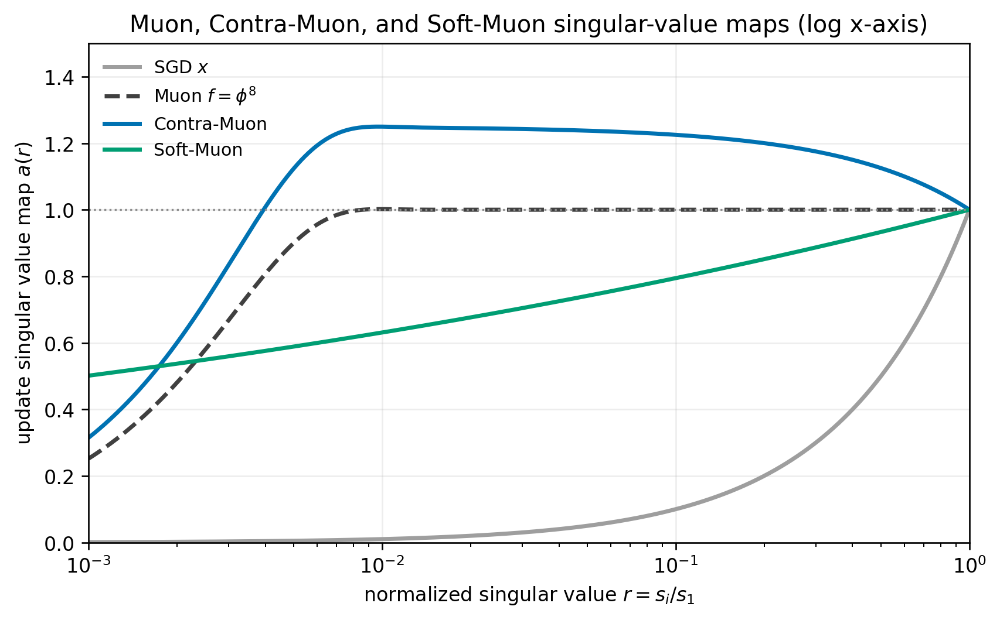

# Contra-Muon to Soft-Muon results

Start with contra-muon for diversity/exploration, interpolate through standard muon to soft-muon for exploitation.
See https://nilin.github.io/contra-muon-and-soft-muon/

The run terminates at 3040 steps. The soft-Muon blend is capped at `0.8`.

Across 30 non-cherry-picked seed logfiles currently in this directory, the
step 3030 mean validation loss is 3.27901467. Under the Track 3 README
criterion, `(3.28 - mu) * sqrt(n) = 0.00539689`, which exceeds the required
`0.004` threshold. Equivalently, using the README's `sigma=0.0013` one-sided
z-test gives `z=4.1515` and `p=1.65e-5`, satisfying the p<0.001 criterion at
3030 steps.

The step 3040 values are shown only as the terminal validation losses from the
same logs.

| Seed | Log | 3030 val | 3040 val |
| -: | - | -: | -: |
| 0 | [8634073e-2a35-4cf6-b8c4-c00d441523d8.txt](8634073e-2a35-4cf6-b8c4-c00d441523d8.txt) | 3.27779 | 3.27729 |
| 1 | [81540d3b-8dc9-4ad3-8d79-10052cca5354.txt](81540d3b-8dc9-4ad3-8d79-10052cca5354.txt) | 3.27854 | 3.27801 |
| 2 | [d8597384-8cdb-40f5-8bfd-bcde460ceea5.txt](d8597384-8cdb-40f5-8bfd-bcde460ceea5.txt) | 3.28014 | 3.27962 |
| 3 | [7621883d-366f-49f7-ac0f-e297634b72ed.txt](7621883d-366f-49f7-ac0f-e297634b72ed.txt) | 3.28093 | 3.28043 |
| 4 | [fc1593ad-ebd9-4a8a-b695-465180d035a4.txt](fc1593ad-ebd9-4a8a-b695-465180d035a4.txt) | 3.27875 | 3.27822 |
| 5 | [66a8cec3-9bbe-4a29-adef-0f1c2683a749.txt](66a8cec3-9bbe-4a29-adef-0f1c2683a749.txt) | 3.27986 | 3.27934 |
| 6 | [c4935f3f-6d44-445c-a52d-d119f9f978c7.txt](c4935f3f-6d44-445c-a52d-d119f9f978c7.txt) | 3.27762 | 3.27710 |
| 7 | [480f6098-b753-4ea0-b82a-c9f687a2ca95.txt](480f6098-b753-4ea0-b82a-c9f687a2ca95.txt) | 3.27756 | 3.27705 |
| 8 | [21827b54-ae4d-40ef-94ab-c005af6f825c.txt](21827b54-ae4d-40ef-94ab-c005af6f825c.txt) | 3.28073 | 3.28027 |
| 9 | [327b14a0-3ea2-457f-9fef-9ee3fc37bccb.txt](327b14a0-3ea2-457f-9fef-9ee3fc37bccb.txt) | 3.27869 | 3.27818 |
| 10 | [f6d6db35-7565-42da-a4d5-57f3b032a90b.txt](f6d6db35-7565-42da-a4d5-57f3b032a90b.txt) | 3.27877 | 3.27827 |
| 11 | [985d5707-129a-4ff0-b842-21a3941ccd5c.txt](985d5707-129a-4ff0-b842-21a3941ccd5c.txt) | 3.27892 | 3.27839 |
| 12 | [d600f067-1b4f-4c65-bbc4-a16e788740d9.txt](d600f067-1b4f-4c65-bbc4-a16e788740d9.txt) | 3.27685 | 3.27633 |
| 13 | [06a3e0e1-8e1b-4474-93bf-c792542a327e.txt](06a3e0e1-8e1b-4474-93bf-c792542a327e.txt) | 3.27991 | 3.27942 |
| 14 | [2aefade8-e52d-42b0-b2a5-318a04fecdab.txt](2aefade8-e52d-42b0-b2a5-318a04fecdab.txt) | 3.27961 | 3.27908 |
| 15 | [8b87aa90-e7fc-42f6-9ef0-6f2fe2342014.txt](8b87aa90-e7fc-42f6-9ef0-6f2fe2342014.txt) | 3.27882 | 3.27828 |
| 16 | [18b5ac94-fbec-4809-b599-5abf453bb08a.txt](18b5ac94-fbec-4809-b599-5abf453bb08a.txt) | 3.27906 | 3.27855 |
| 17 | [a182bdc9-0e85-4518-91b3-1f2f59ece258.txt](a182bdc9-0e85-4518-91b3-1f2f59ece258.txt) | 3.27800 | 3.27750 |
| 18 | [9b15a60b-7cf6-42ec-a5ca-2c2ee33e3619.txt](9b15a60b-7cf6-42ec-a5ca-2c2ee33e3619.txt) | 3.28011 | 3.27960 |
| 19 | [58589cfb-aee6-4e3d-9e2b-4c0c5d918310.txt](58589cfb-aee6-4e3d-9e2b-4c0c5d918310.txt) | 3.27924 | 3.27871 |
| 20 | [38509716-92e8-4592-a6b9-3cd92683678a.txt](38509716-92e8-4592-a6b9-3cd92683678a.txt) | 3.27692 | 3.27641 |
| 21 | [c53f1f7e-427c-4066-b4ed-16f90ea73276.txt](c53f1f7e-427c-4066-b4ed-16f90ea73276.txt) | 3.27888 | 3.27836 |
| 22 | [1b5bba11-4050-486d-9b09-ea4cba74115a.txt](1b5bba11-4050-486d-9b09-ea4cba74115a.txt) | 3.27897 | 3.27843 |
| 23 | [b78e2987-2cbc-42cd-a511-28f9720cc53b.txt](b78e2987-2cbc-42cd-a511-28f9720cc53b.txt) | 3.27942 | 3.27892 |
| 24 | [6df65d01-43cb-46bb-84e1-8f972ca7f811.txt](6df65d01-43cb-46bb-84e1-8f972ca7f811.txt) | 3.28132 | 3.28081 |
| 25 | [c3719539-5569-463e-a426-98236100a098.txt](c3719539-5569-463e-a426-98236100a098.txt) | 3.28002 | 3.27949 |
| 26 | [9304dc26-dc96-4074-958b-7f28381d86ca.txt](9304dc26-dc96-4074-958b-7f28381d86ca.txt) | 3.27907 | 3.27858 |
| 27 | [19041821-ef1e-4cc9-b004-1cea453f9e11.txt](19041821-ef1e-4cc9-b004-1cea453f9e11.txt) | 3.27909 | 3.27856 |
| 28 | [03c36e81-e2e5-4916-bf16-0141999b1dbb.txt](03c36e81-e2e5-4916-bf16-0141999b1dbb.txt) | 3.27717 | 3.27665 |
| 29 | [e33e54bd-d3f3-42f3-a18e-26ad67a5c193.txt](e33e54bd-d3f3-42f3-a18e-26ad67a5c193.txt) | 3.27968 | 3.27915 |
| **Mean** |  | **3.27901467** | **3.27850000** |

# Credits

This submission incorporates features from the following previous submissions:

- @kumarkrishna PR274 / Skylight-001: NorMuon-lite row/column variance normalization, u/w floor postprocessing, and lr=0.0375 style Muon setup.
- @nilin (me) PR275 / Contra-Muon: introduces Contra-Muon update term.
- @samacqua PR278 / MLP SOAP preconditioning: SOAP preconditioning machinery / MLP SOAP idea. Our script uses that SOAP machinery and extends the selected SOAP set to MLP+V.
- @yash-oai PR287 / power law LR schedule PowerCool: learning rate `c * (t_end - step)^1.2` during cooldown.

The SOAP-like preconditioning from samacqua / PR278 is also applied to the attention value-projection (V) matrices in this submission.
